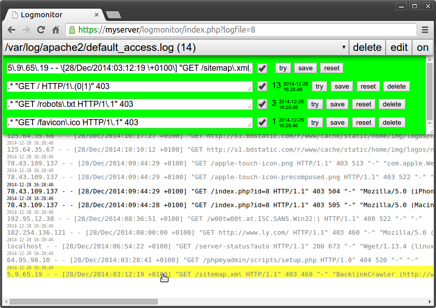

logmonitor
==========

A python daemon polling log files and matching new lines to regex expressions stored in a MySQL database. Lines not matching any of the given rules are stored in an "offender" table in the same database.

Also contained is a webinterface script (written in PHP), to manage all the necessary configurations on the fly. It allows one to periodically check on offending lines and use them as templates to create new matching rules. In this way, one quickly and conveniently builds a comprehensive whitelist for all monitored logfiles.

Installation
------------

1. Create a MySQL database and import the tables from logmonitor.sql
2. Store the MySQL login credentials as well as the database name in .ht_dblogin
3. Place a copy of logmonitor.py and .ht_dblogin anywhere on your server
4. Adapt the path in logmonitor.conf and store this file in /etc/init
5. Start the service by executing 'start logmonitor' as root
6. Check out the /var/log/logmonitor.log
7. Place a copy of webinterface.php and .ht_dblogin somewhere accessible through a webserver

Usage
-----
* Add files to be monitored through the webinterface
* Refresh to see parsed lines from logfiles. You can now add rules by clicking on logfile lines and edit the resulting regex in the green bar. Note that the green bar can be pulled down, revealing all rules applied to this file as well as options to edit them, and statistics of their usage. The single number next to the rule represents a running average of the times the rule matched in a 24h period, the time is that of the last match.
